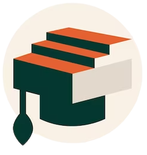

  

# Knowie
This is an online school exam project created to PWEB class at Federal Institute of Alagoas.

## Configuration
You should have Docker compose, Maven and JDK 17 installed on your machine.

* On root folder, run `docker compose up -d` to build the and run the project.
* You can make login as ADMIN using the follow credentials: email: admin, password: admin

## API
* [Application url](http://localhost:8080/api/v1)
* [Mysql](http://localhost:3306)
* [Prometheus](http://localhost:9090)

## Contributors
* [Gabriel Syphan](https://github.com/gabrielsyphan)
* [Knowie Website](http://knowie.site)
